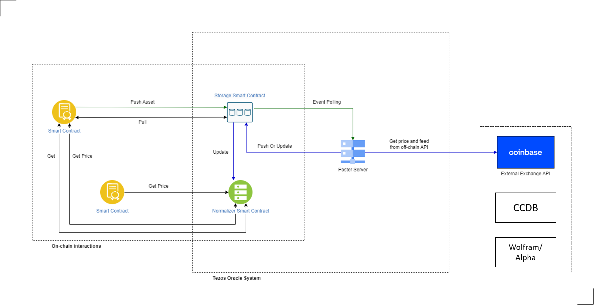

# Wolfram Oracle System

A Wolfram bridge oracle server to provide off-chain data on tezos blockchain.

## Repositories
- [Oralce contracts](https://github.com/Wolframbridge_org/contracts): Contains reference implementations for Wolfram oracle smart contracts
- [Oracle Server](https://github.com/Wolframbridge_org): Contains reference implementation of a posting service via VPS or AWS

## Basic Terminology



### Oracle Server
It is used to feed off-chain data in your oracle contract(s). 
Server should be able to fetch data from any API.
This server serves as a vital link in the chain, akin to a [Harbinger-poster](https://github.com/tacoinfra/harbinger-poster) or [Harbinger-signer](https://github.com/tacoinfra/harbinger-signer).
Its primary purpose is to connect the **[contracts][contracts]** to established cryptocurrency exchange APIs, facilitating the semless flow of price data.
The server's operation is triggered by the receipt of a push event from the **[contracts][contracts]**. 
Utimately, this setup empowers requestors to accesss up-to-date price data from the **[contracts][contracts]** using the pull entry points.
It's worth noting that this server can be hosted on various platforms, such as private server(e.g., VPS) or cloud server like AWS or GCP. Additionally, it's adaptable, allowing for the cincorporation of additinal off-chain data sources as needed.


### Oracle Contract
Wolfram Oracle Contract is made up of two contracts:
- **Price Storage Contract**: Stores the latest price data for each market. users can push and pull the specific asset as well as can get latest price data
- **Normalizer Contract**: Normalizes *n* data points from an specific market oracle by computing a volume weighted averge price form the latst *n* updates.

For convenience, these two contacts are precompiled to Michelson in `oracle.tz` and `normalizer.tz`. If you wish to compile the contracts yourself, please see 
'Building and Testing' below.

Additionally, the follwing files provide helper functionally and are not top-level contracts:
- `fifo_queue.py`: A FIFO queue implementation
- `common.py`: Common Utility functions

#### Building and Testing

Oralcle contracts are written in [SmartPy](https://legacy.smartpy.io). Please consult the [SmartPy Documentation](https://legacy.smartpy.io/demo/reference.html) for instructions on how to install and get started with the SmartPy command line toools.

You can ran tests and compile with:
```shell
$ make all
```

To manually compile a contract:
```shell
$ make compile-oracle
$ make compile-normalizer
```

To manually test a contract:
```shell
$ make test-oracle
$ make test-normalizer
```

#### Contract Specifications
Oracle smart contract can support price feed for any assets and other types of feeds by adding push/pull features.
Users can get any type of feed data from our oracle contract by using an off-chain data supplier.
Users can use asset identifiers and urls like DEX/CEX api url, weather feed url, temperature feed url, etc as parameters of push requesting.
And they can pull data they requested at any time to the oracle smart contract.

##### Oracle contract 
It enables other smart contracts to get any price data at any time. It provides with 3 entry points like push, pull, update	.

- **`push`**: Pushes the asset with feed url to the contract
- **`pull`**: Pull the asset data from the contract
- **`update`**: Recives an updates to the oracle contract

##### Normalizer contract
It normalizes by computing a volume weighted average price.
It also provides entry points for other smart contracts to get normalized prices.

- **`updates`**: Receives data from an oracle contract

## Procedure

1. To run oracle server node and to consume data from server Node using a oracle contract you have to deploy oracle contracts. Sample oracle contracts are under **[contracts][contracts]** folder.
2. Once your contracts are deployed, you can feed data points using oracle entry points
3. Once the server node is successfully running, anyone can consume relevant data from oracle contract.
4. A client contract should push and pull assets with feed url information to receive data from oracle contract. Sample client contracts are under **EuropeanCallSample** folder.
5. While deploying client contract make sure you have given correct Oracle contract’s address.
6. Test the client contract by sending the requesting your entrypoint to fetch data from oracle contract.

## Getting Started

This project is intended to be used with the latest Active LTS release of [Node.js][nodejs] .

### Clone repository

To clone the repository use the following commands:

```sh
git clone https://github.com/WolframBlockchainLabs/WolframBridge/Tezos_oracle.git
cd Tezos_oracle
npm install
```

### Deploy Oracle contract
Precompiled Oracle contracts are under **[contracts][contracts]** folder.

To deploy a **contract**, add **privateKey** and **publicKey** value under **config.json**.
```
npm run deploy
```

### Configure Server

+ ##### Edit Tezos Configuration

```json
{
      "tezosConfig":{
         "nodeAddress":"ADDRESS-WHERE-YOU-ARE-GOING-TO-DEPLOY YOUR-SMART-CONTRACT",
         "publicKey":"PUBLIC-KEY-WHICH-WILL-BE-USED-TO-SEND-TRANSACTION-TO-BLOCKCHAIN",
         "privateKey":"PRIVATE-KEY-WHICH-WILL-BE-USED-TO-SEND-TRANSACTION-TO-BLOCKCHAIN",
         "keyHash":"KEY-HASH-WHICH-WILL-BE-USED-TO-SEND-TRANSACTION-TO-BLOCKCHAIN",
      },
	"eventName": "REQUESTED_PUSHED",
	"apiKeyID": "API-KEY-FROM-COINBASE",
	"apiSecret": "API-SECRET-FROM-COINBASE",
	"apiPassphrase": "API-PASSPHRASE-FROM-COINBASE",
	"API_KEY":"API-KEY"
   }
```
You can use https://146.190.49.250 which is a Tezos Oracle node.

#### Edit API Configuration

You can add as many as endpoints you want to Oracle adapter. You need to configure the endpoints carefully.

Now server support getPrice endpoints.
More endpoints for various data feed will be added.

### Start the Server
Run
```bash
npm run start
```

### Start the API erver
Run
```bash
npm run apistart
```

##### Available Scripts
+ `clean` - remove coverage data and transpiled files,
+ `build` - transpile TypeScript to ES6,
+ `lint` - lint source files and tests
+ `apistart` - start api server

### Develop and deploy client contract and test your Oracle
Sample client contracts for European Call Option are under **[EuropeanCallSample][EuropeanCallSample]** folder.
A client contract should push and pull to receive data from oracle contract.
Here is a smartpy snippet for reference. [Smartpy][smartpy]

## Future Development
We'll be adding some new set of features to provide more customisation to Server Node, stay tuned!

## License
Licensed under the MIT. See the [LICENSE](https://github.com/Wolframbridge_org/MIT) file for details.

[nodejs]: https://nodejs.org/dist/latest-v12.x/docs/api/
[smartpy]: https://smartpy.io/dev/
[oracle-contract]:https://github.com/Wolframbridge_org/contracts
[test-contract]: https://github.com/Wolframbridge_org/EuropeanCallSample